# MNML

A minimal card set for Home Assistant, with its editors, its templates and its theme, in one integration. Flat cards on one hairline edge, colour only where something needs you, and pop-ups that open by the URL hash, so the back button and a shared link both work.

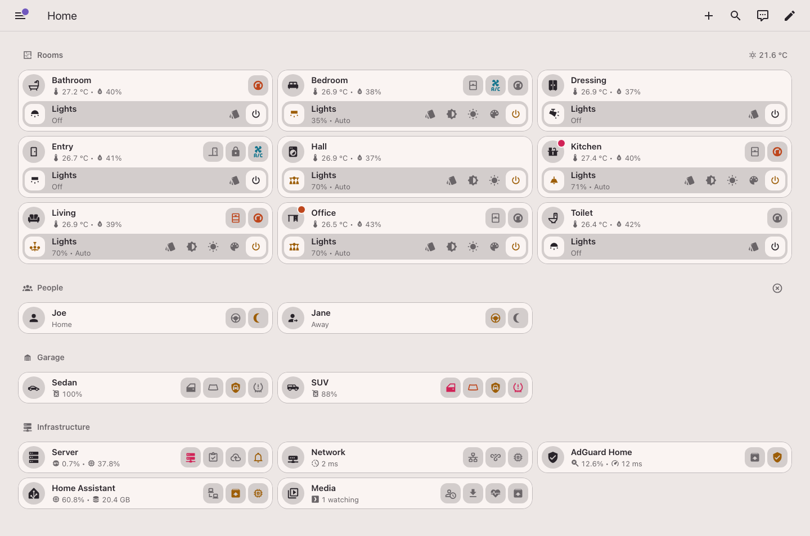

## What you get

- **Cards** for the things a home is made of: a room tile with its chips, items with their controls, lists and tables, a heading per section, a media card, a car seen from above, an agenda, a messages feed and a client list. Every card is plain YAML, `type: custom:mnml-<name>-card`.
- **Pop-ups** for everything a tile opens, drawn by one `custom:mnml-popups-card` on the dashboard and opened by hash (`#living`, `#living-lights`). They are dialogs on a desktop and sheets on a phone, and moving from one to another keeps the backdrop still.
- **Templates** for whole tiles and their pop-ups: a room, a person, a car, a server, the network, AdGuard Home, Home Assistant and a media server. Place one by area and it finds its own entities, or spell its slots by hand, or write your own.
- **A theme**, light and dark, that the cards are designed for, installed with them. The cards also work under any other.
- **A home generator** for those who keep their dashboard in code: describe the home once, typed, and get the whole dashboard.

## Screenshots

| Desktop, dark                                                   | Phone                                                         |
| --------------------------------------------------------------- | ------------------------------------------------------------- |
| 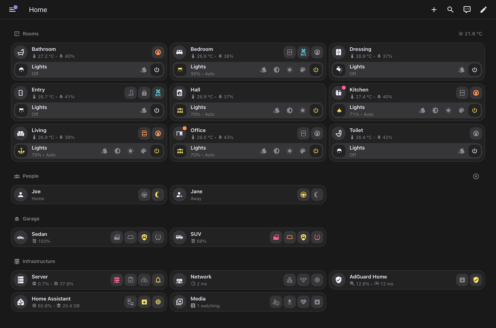 | 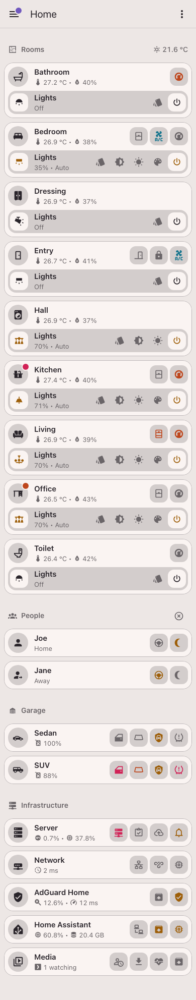 |

| A room                                                       | Its lights                                                            | A car                                                 |
| ------------------------------------------------------------ | --------------------------------------------------------------------- | ----------------------------------------------------- |
| 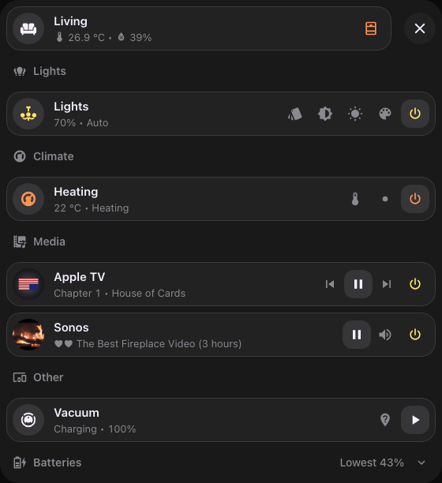 | 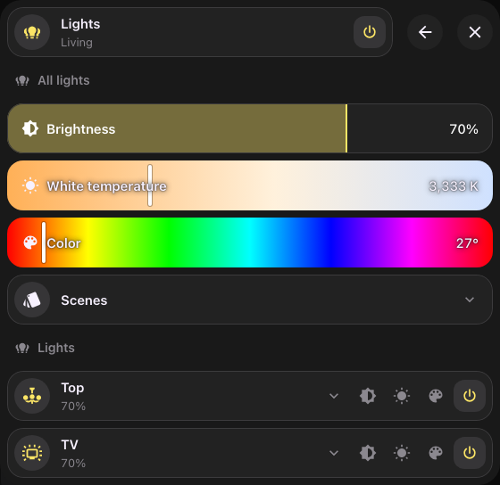 | 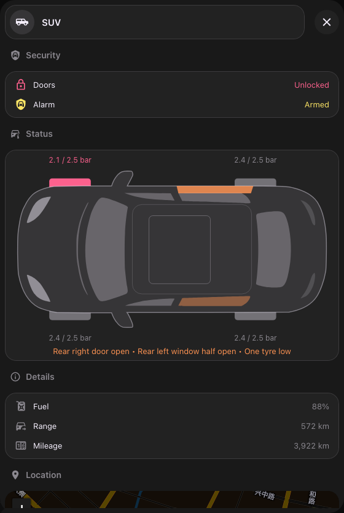 |

| The server                                               | A 3D printer                                                           | The media server                                             |
| -------------------------------------------------------- | ---------------------------------------------------------------------- | ------------------------------------------------------------ |
| 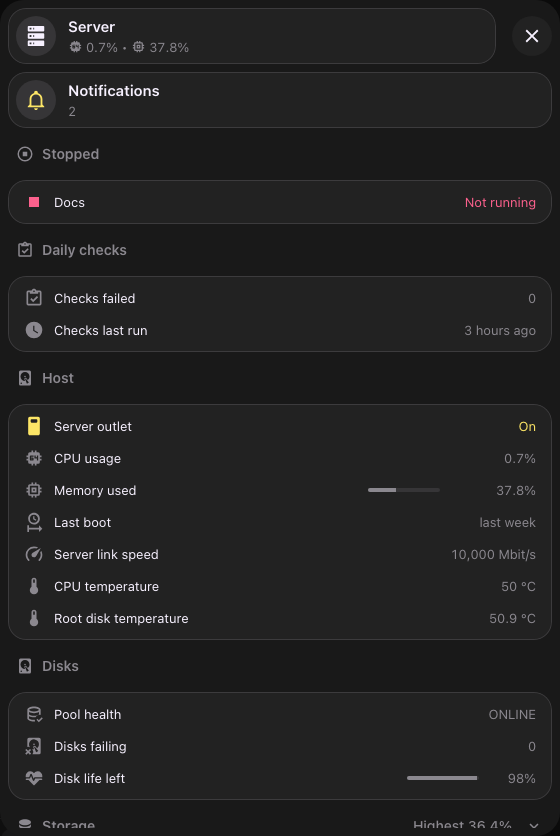 | 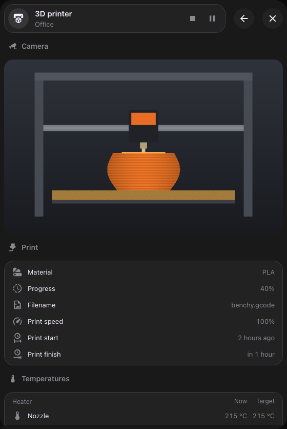 | 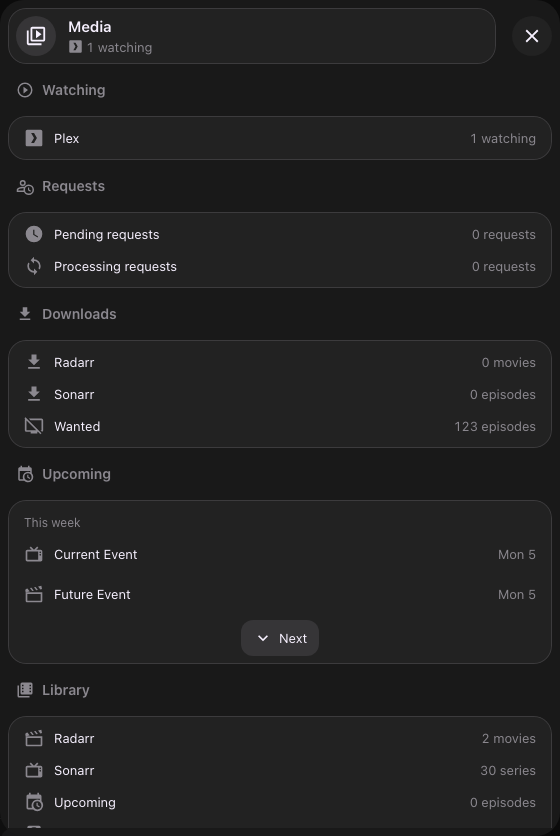 |

Every screenshot is of the demo home, Joe's and Jane's, on a throwaway Home Assistant; `pnpm screenshots` takes them again.

## Install

MNML is a Home Assistant integration. It brings the cards, their editors, the shipped templates and the MNML theme; there is no dashboard resource and no theme file to add.

**With HACS:** add `https://github.com/bfmatei/ha-mnml` as a custom repository of type **Integration**, install **MNML**, and restart Home Assistant.

**By hand:** unpack `mnml.zip` from a release into `config/custom_components/mnml/`, and restart Home Assistant.

Then add **MNML** in Settings, Devices & services. Pick **MNML** as the theme in your profile, or turn on **Use MNML as the default theme** in the integration's options.

The theme lives in `config/themes/mnml-integration/`, which the integration owns and rewrites on each update. Home Assistant must load themes from `config/themes/` (`frontend: themes: !include_dir_merge_named themes`, as its default configuration does); when it does not, the integration takes its theme away again and a repair says what to change. A repair also says so when a dashboard resource still loads MNML Cards by hand, or another theme is named MNML.

## Quick start

Add the one pop-up card anywhere on the dashboard; it takes no space:

```yaml
type: custom:mnml-popups-card
width: 560px
```

Then a room, found from one of your areas:

```yaml
type: custom:mnml-template-card
template: room
area: living
```

That draws the living room's tile, with its temperature and humidity, its window, door and lock, its lights and their controls, and a problems dot for a low battery or a leak. Tapping it opens the room's pop-up, and from there the lights, the heating, the AC, the vacuum and the speakers, whichever the area has.

A slot set by hand wins over what the area finds, so a template can be corrected one slot at a time:

```yaml
type: custom:mnml-template-card
template: room
area: living
slots:
  icon: mdi:sofa
```

## Your own templates

The **MNML** panel in Home Assistant's sidebar, for admins, keeps the home's templates. Its library lists every template, shipped, customised and the home's own, with where each is used. A template opens in a builder:

- the outline of its card and pop-ups;
- a live preview, on the example or on any area;
- the selected part's fields, each a value or a slot.

Slots and their discovery rules are set as sentences ("Find the first sensor with device class temperature in the area"). YAML is one tab among them.

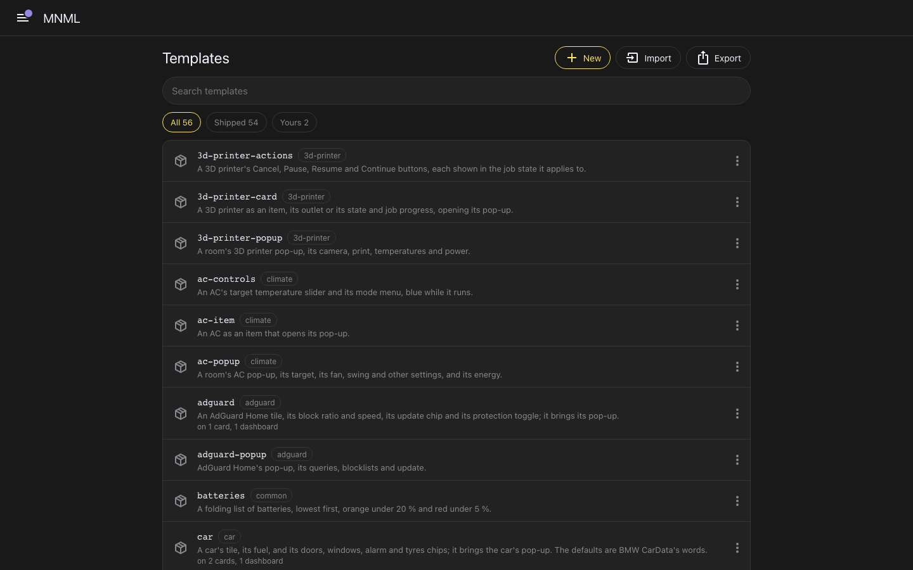

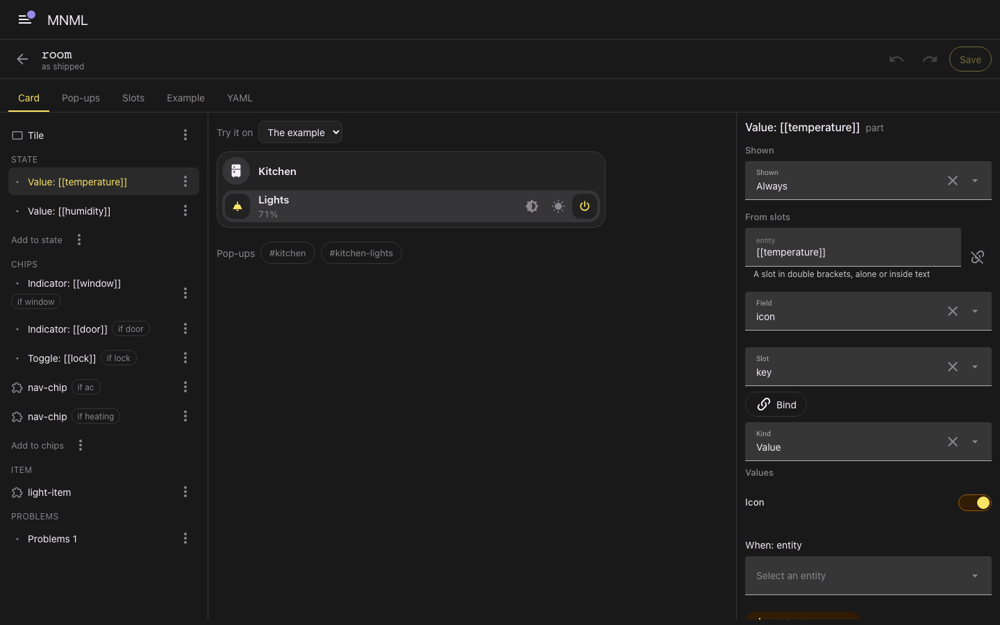

A change to a shipped template is kept as changes laid over it, so a release that improves the template still reaches the parts you left alone; the builder marks a change a release has since touched. The integration keeps everything in `.storage/mnml.templates`, with the last ten versions of each template, and every open dashboard follows a save at once. When two places have the same name, the first wins:

1. **The home's own templates.**
2. **A shipped template with the home's changes.**
3. **The shipped templates.**

A template with a shipped name replaces the shipped one everywhere, inside other templates too. The library imports and exports templates as YAML; it offers to import the `mnml_templates:` a dashboard holds, which the cards do not read. [Templates](docs/templates.md#where-templates-live) and [Editing in the UI](docs/editors.md#the-mnml-panel) have the rest.

## Editing in the UI

Every card is in Home Assistant's card picker (**Add card**, **By card**, then search for MNML), and every card with keys but the pop-ups card opens in a form: Home Assistant's own pickers for entities and icons, sections that open on a click, and a list editor for controls, rows and the other parts, with copy and paste between cards. The template card's editor has a gallery of every template with a live preview, and a form for the chosen template: it finds the template's devices in an area, or in the whole home, or lets you fill them in yourself, in panels the template describes; for an admin, **Edit this template** opens it in the MNML panel. The YAML it writes is the YAML you would write. [Editing in the UI](docs/editors.md) has the details.

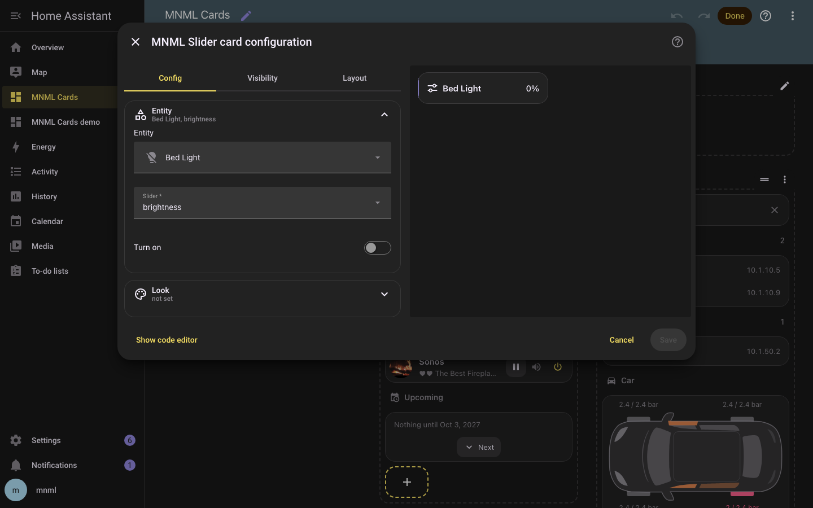

## Learn more

| Page                                 | What it covers                                                                       |
| ------------------------------------ | ------------------------------------------------------------------------------------ |
| [The cards' keys](docs/keys.md)      | Every card and every key it takes; a key a card does not know is an error card       |
| [Templates](docs/templates.md)       | The template language, where the home's templates live, and every template           |
| [Editing in the UI](docs/editors.md) | The card picker, each card's editor, the template card's gallery, and the MNML panel |
| [The home dashboard](docs/home.md)   | What each tile and pop-up of a whole home shows, and why                             |
| [Data the cards read](docs/data.md)  | The sensors the messages, clients and car plan cards expect, and how to make them    |
| [Design](docs/design.md)             | How the cards look and why: colour, sizes, motion                                    |
| [How the cards work](docs/cards.md)  | The pop-up shell, routing, and what the cards take from Home Assistant               |
| [Architecture](docs/architecture.md) | The source tree, the build, releases, tests and the throwaway Home Assistant         |

[examples/cards.yaml](examples/cards.yaml) is a dashboard with one of every card, and [examples/templates.yaml](examples/templates.yaml) one of rooms placed by area.

## The theme

- **Two palettes,** under `modes`, so one theme follows the light and dark setting of each profile; set dark mode to **Auto** to follow the operating system.
- **Shape.** Cards have an 18 px radius and no border or shadow of the theme's own; pop-ups a 24 px radius.
- **The font** is the system stack.
- **Contrast it can prove.** Every accent reads at 4.5:1 or better as text on a card, every icon at 3:1 on its surface, and the build refuses to write a theme where one claim stops holding.
- **The cards' variables:** the pill colour, the card edge, and the pop-up's background, radius and gap. The cards work without them, under any theme; with them they look as designed.

[The theme](docs/theme.md) has the mapping onto Home Assistant's variables, and every contrast claim.

## Your own home, in code

If you keep your dashboard in code, describe the home as one typed `Home` (`src/home/types.ts`): its rooms, people, cars and systems, with every entity id spelled. Then:

- `build(home)` is the dashboard, ready to save or write as YAML;
- `drawn(home)` is the same dashboard as the templates expand it, for a tool that checks entity ids;
- `problems(home)` lists what would break it: a hash opened that no pop-up defines, a key used twice, a subnet that is no IPv4 range.

`demo/home.ts` is a complete home to start from.

## The demo

The demo is a whole home: nine rooms, Joe and Jane, two cars, a server, the network, AdGuard Home, Home Assistant and a media server, so every tile and pop-up MNML has. It runs on a throwaway Home Assistant in Docker, with the `demo` integration, the entities `demo/entities.ts` makes for it, and MNML itself from this folder. With Docker running, `pnpm demo` starts it at `http://localhost:8124`, with the demo and the examples as dashboards; its first run makes the owner `demo`, password `demo`. [Architecture](docs/architecture.md#the-throwaway-home-assistant) has what it does.

## Working on MNML

You need Node 22.18 or newer, pnpm (the version `packageManager` in `package.json` names), uv (for Python 3.14), and Docker, for `pnpm check`'s hassfest and for the throwaway Home Assistant.

```bash
pnpm install && uv sync
pnpm check    # format, lint and type check, Markdown lint, dead code, ruff, mypy, hassfest, the tests: the gate
pnpm fix      # the part ids, format, and fix what the linters can
pnpm test     # vitest, then pytest
pnpm build    # custom_components/mnml/www/: the cards, the loader, the editors, the panel, the template families and the theme
pnpm zip      # mnml.zip, the release, from custom_components/mnml/
pnpm demo     # the throwaway Home Assistant, running the integration, with the demo and the examples
pnpm look     # every card, template, editor, pop-up and the panel on the throwaway, in both themes, phone and desktop
pnpm walk     # the panel walked through on the throwaway: edit, save, reset, new, duplicate, delete
```

[AGENTS.md](AGENTS.md) holds the working rules, for people and coding agents alike.

## License

MIT
